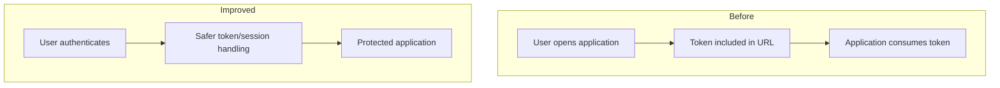

# Clinical Record Auditing

**Domain:** Healthtech  
**Type of work:** Application security and hardening  
**Repository:** Private  
**Role:** Full Stack Developer

## Context

This application supports the evaluation and auditing of clinical records.

My contribution to this project has been focused primarily on **application security**, rather than claiming ownership of the platform as a whole.

## My contribution

The work included:

- removing authentication-token exposure from URLs;
- reviewing authentication flows and client/server token handling;
- addressing security-header findings;
- strengthening HTTP security configuration;
- reducing avoidable information exposure;
- reviewing application surfaces that could be hardened.

One of the tools used during this process was [SecurityHeaders.com](https://securityheaders.com/) to identify missing or weak HTTP security policies.

## Why tokens in URLs are risky

URLs can unintentionally propagate sensitive values through:

- browser history;
- server and proxy logs;
- analytics systems;
- screenshots;
- copied links;
- referrer information.

Moving authentication information away from URLs reduces unnecessary exposure and creates a safer authentication flow.

## Simplified authentication improvement

The exact authentication implementation is intentionally not documented.

## HTTP hardening

The project also involved reviewing browser-facing security policies and improving the application's HTTP security posture.

Examples of the types of controls evaluated during hardening include:

- Content Security Policy;
- transport security;
- content-type protections;
- framing restrictions;
- referrer behavior;
- permissions policies.

Only controls actually appropriate for the application should be enabled; security headers should not be copied blindly without considering application behavior.

## Technologies

`Next.js` · `React` · `TypeScript` · `Node.js` · `Express.js` · `MongoDB` · `JWT` · `Helmet`

## What this project demonstrates

- Security work on an existing production-oriented application.
- Identifying exposure created by authentication design choices.
- Improving security without claiming to have built the entire product.
- Using automated security feedback as input, then validating changes against application behavior.
- Treating browser and HTTP configuration as part of application security.

## Confidentiality

Authentication implementation details, vulnerabilities, infrastructure, client information, clinical data and proprietary code are intentionally excluded.
