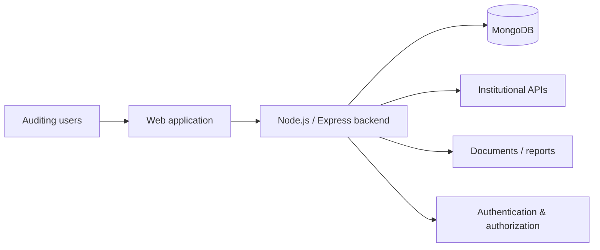

# Concurrent Hospital Auditing

**Domain:** Healthtech  
**Type of work:** Enterprise product development and evolution  
**Repository:** Private  
**Role:** Full Stack Developer

## Context

This platform supports concurrent hospital auditing workflows. It centralizes operational and clinical-review information used during hospitalization and provides tools for follow-up, traceability, reporting and other auditing processes.

I joined the project during an **early stage**, when a partial base of modules already existed. From that starting point, I progressively helped build and evolve the system as new operational requirements appeared.

## My contribution

My work has included:

- developing and extending backend modules and business flows;
- implementing REST endpoints, controllers, validations and data models;
- evolving workflows related to concurrent notes and hospital auditing;
- working on hospital-discharge and follow-up functionality;
- supporting reporting and operational indicators;
- integrating information coming from institutional services/APIs;
- improving database queries and code organization;
- strengthening authentication, authorization and application security;
- improving traceability and consistency across critical flows.

The project has grown incrementally, so a significant part of the work has involved understanding existing behavior before introducing new functionality without breaking previous workflows.

## Simplified architecture

This diagram is intentionally generic and does not represent private infrastructure.

## Engineering challenges

### Evolving an existing product

The system was not built in a single iteration. Requirements changed as the auditing process evolved, which meant working with existing modules while introducing new rules and keeping compatibility with previous behavior.

### Complex business rules

Healthcare auditing workflows contain conditional information and relationships between notes, patient episodes, follow-up records and operational states. Backend logic therefore needed to be explicit and maintainable rather than being spread across views or controllers.

### Traceability

Changes to auditing information can be operationally important. Maintaining consistent history and understanding who changed what is a key concern in this type of system.

### Integrations

Part of the application depends on information received from external/institutional services, which requires defensive validation and careful handling of incomplete or changing payloads.

## Security work

Security has been a recurring responsibility in this project. The work has included areas such as:

- authentication and authorization controls;
- role-based access;
- request validation;
- HTTP security hardening;
- protection of routes and sensitive operations;
- safer handling of application data;
- review of exposed attack surfaces.

The specific infrastructure and security configuration are intentionally not published.

## Technologies

`Node.js` · `Express.js` · `MongoDB` · `Mongoose` · `EJS` · `REST APIs` · `ExcelJS` · `JWT` · `Helmet`

## What this project demonstrates

- Working on an enterprise product from an early stage.
- Growing a system incrementally instead of rebuilding everything from scratch.
- Translating operational requirements into backend rules and modules.
- Working with integrations and data coming from external systems.
- Building reporting and traceability around real business processes.
- Treating security as part of development, not as a final add-on.

## Confidentiality

Client identity, patient information, internal endpoints, infrastructure details, proprietary code and screenshots containing sensitive data are intentionally excluded.
