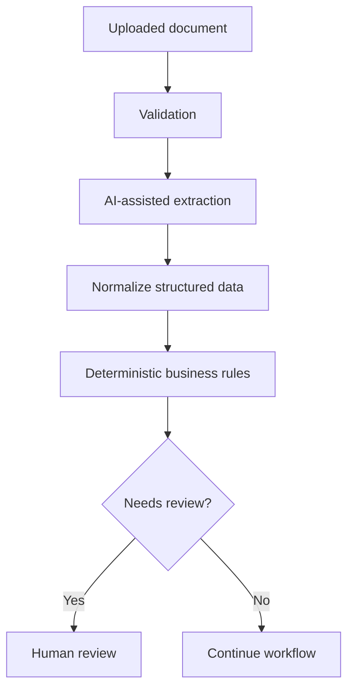

# Financial Applications Platform

**Domain:** Fintech / financial operations  
**Type of work:** Product transformation and reengineering  
**Repository:** Private  
**Role:** Full Stack Developer

## Context

The starting point for this project was an existing application originally designed for **legal-sector workflows**.

My work has focused on progressively transforming that codebase into a platform for **financial application management and analysis**, adapting the product to a substantially different business domain.

This is not simply a visual redesign: changing domains requires revisiting data models, workflows, terminology, validations, document handling and business rules.

## My contribution

My work has included:

- transforming modules inherited from the original legal application;
- adapting data structures and flows to financial processes;
- developing and modifying backend logic for financial applications;
- working with document-heavy workflows;
- integrating automated document processing;
- supporting rules used during financial analysis;
- integrating external services where required;
- improving authentication, authorization and application security;
- progressively removing assumptions tied to the original legal domain.

## Simplified flow

The actual implementation contains additional flows and integrations that are not shown for confidentiality reasons.

## Product transformation

The most relevant engineering challenge is that the platform was **not originally designed for its current purpose**.

That means each change requires distinguishing between:

- reusable infrastructure;
- legal-domain assumptions that should be removed;
- models that can be adapted;
- flows that need to be redesigned;
- terminology that no longer represents the business;
- security expectations for the new context.

This kind of work requires understanding the existing system deeply enough to evolve it without carrying unnecessary legacy behavior into the new product.

## Document processing

The application includes automated processing of financial documents to extract structured information that can later be evaluated by backend rules.

Where AI-assisted extraction is used, it is treated as part of a wider process rather than as an autonomous decision-maker.

This separation is important because extracted information and final business decisions are different concerns.

## Security work

Because the platform handles financial workflows and documents, I have also worked on security-related improvements, including:

- authentication and authorization;
- validation of incoming data;
- protection of sensitive routes and operations;
- safer document-processing flows;
- HTTP/application hardening;
- reducing unnecessary exposure inherited from the previous system.

## Technologies

`Node.js` · `Express.js` · `MongoDB` · `Mongoose` · `EJS` · `REST APIs` · `Gemini` · `Puppeteer` · `Socket.IO` · `S3-compatible storage` · `ExcelJS`

## What this project demonstrates

- Reengineering an existing product for a different industry.
- Working with legacy assumptions instead of starting from a blank repository.
- Designing document-oriented backend workflows.
- Combining automated extraction with deterministic business logic and human review.
- Maintaining security while the system is being transformed.
- Converting changing business requirements into an evolving software product.

## Confidentiality

The original product name, financial entity, internal rules, documents, customer information, infrastructure details and proprietary source code are intentionally excluded.
