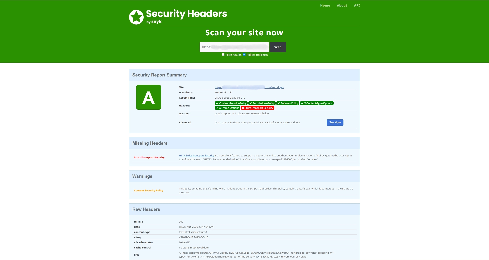
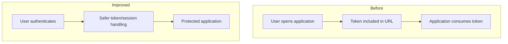

# Clinical Record Auditing

| | |
| --- | --- |
| **Domain** | Healthtech |
| **Role** | Full Stack Developer |
| **Work type** | Application security and hardening |
| **Focus** | Authentication · Token handling · HTTP security |
| **Repository** | Private |

## Context

This application supports the evaluation and auditing of clinical records.

My contribution to this project has been focused primarily on **application security**, rather than ownership of the platform as a whole.

## My contribution

The work included:

- removing authentication-token exposure from URLs;
- reviewing authentication flows and client/server token handling;
- addressing security-header findings;
- strengthening HTTP security configuration;
- reducing avoidable information exposure;
- reviewing application surfaces that could be hardened.

One of the external tools used during this process was [SecurityHeaders.com](https://securityheaders.com/) to identify missing or weak HTTP security policies.

## Evidence

### Sanitized HTTP security assessment

  

A post-hardening scan returned an **A grade** while still identifying follow-up opportunities. The image is intentionally sanitized so the host, IP address and private infrastructure are not exposed.

## Why tokens in URLs are risky

URLs can unintentionally propagate sensitive values through:

- browser history;
- server and proxy logs;
- analytics systems;
- screenshots;
- copied links;
- referrer information.

Moving authentication information away from URLs reduces unnecessary exposure and creates a safer authentication flow.

## Simplified authentication improvement

The exact authentication implementation is intentionally not documented.

## HTTP hardening

The project also involved reviewing browser-facing security policies and improving the application's HTTP security posture.

Examples of the types of controls evaluated include:

- Content Security Policy;
- transport security;
- content-type protections;
- framing restrictions;
- referrer behavior;
- permissions policies.

Security headers should not be copied blindly; each policy must be compatible with the application's real behavior.

## Technologies

`Next.js` · `React` · `TypeScript` · `Node.js` · `Express.js` · `MongoDB` · `JWT` · `Helmet`

## Outcome

The authentication flow no longer relies on exposing the token through the URL, reducing avoidable leakage through browser history, logs, copied links and related channels.

The application also gained a stronger browser-facing HTTP security configuration. An external scan provides visible evidence of that hardening without exposing the underlying implementation.

## What this project demonstrates

- Security work on an existing application.
- Identifying exposure created by authentication design choices.
- Improving security without claiming ownership of the full product.
- Using automated security feedback as input and validating changes against application behavior.
- Treating HTTP configuration as part of application security.

## Confidentiality

Authentication implementation details, vulnerabilities, infrastructure, client information, clinical data and proprietary source code are intentionally excluded.

---

**Navigation:** [← Financial Applications Platform](./financial-applications-platform.md) · [Overview](../README.md) · [Next: Clinical Research Management →](./clinical-research-management.md)
