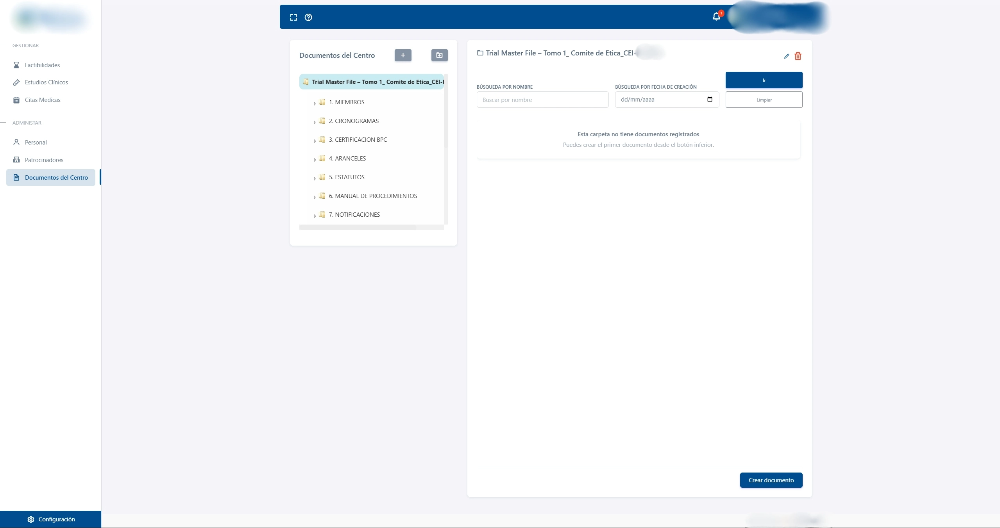
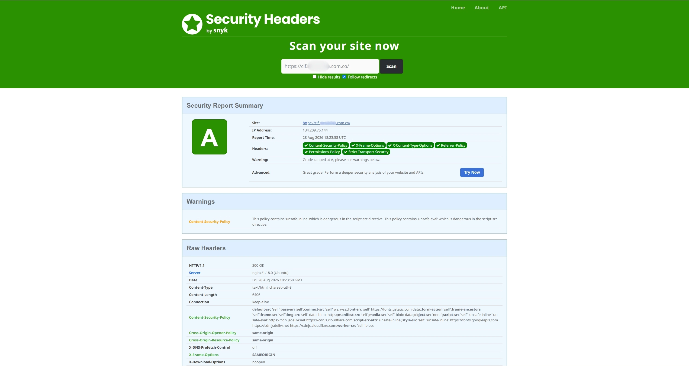

# Clinical Research Management

| | |
| --- | --- |
| **Domain** | Healthtech / clinical research |
| **Role** | Full Stack Developer |
| **Work type** | Maintenance, document storage and security |
| **Focus** | Debugging · Document organization · Security |
| **Repository** | Private |

## Context

This is a large enterprise application used to support clinical-research management workflows.

The platform contains modules related to studies, documentation, operational follow-up and other research processes.

My contribution has been **targeted rather than ownership of the complete system**.

## My contribution

My work has focused on:

- diagnosing and fixing bugs in document-folder organization;
- correcting behavior in document-storage workflows;
- improving reliability around file organization;
- understanding existing modules before modifying them;
- participating in application-security improvements similar to those made in other enterprise projects.

## Product evidence

### Document organization

  

The document center organizes research documentation into structured folders. Correct folder resolution is important because storage objects and application metadata need to remain aligned.

### HTTP security assessment

  

Security hardening was also part of my work. Hostnames, IP addresses and private infrastructure are removed from the public image.

## Document-management flow

A problem at the folder-resolution stage can make a document difficult to locate even when the physical upload itself succeeded.

## Debugging approach

When working on an established codebase, I prefer to:

1. reproduce the issue;
2. trace the complete data/storage flow;
3. identify whether the problem belongs to metadata, storage, business logic or presentation;
4. make the smallest safe change;
5. validate adjacent workflows to reduce regression risk.

This matters especially in applications with many interconnected modules.

## Security work

I also participated in application-security improvements, including review of authentication behavior, HTTP security configuration and other hardening opportunities.

The details are intentionally generalized to avoid publishing private implementation or security information.

## Technologies

`Node.js` · `Express.js` · `MongoDB` · `Mongoose` · `EJS` · `S3-compatible storage` · `REST APIs`

## Outcome

The document-management fixes restored more consistent alignment between the application's folder organization, stored files and document metadata, reducing the risk of documents becoming difficult to locate because of incorrect folder-resolution behavior.

The security work also strengthened the application's HTTP-facing posture while preserving compatibility with the existing system.

## What this project demonstrates

- Debugging an unfamiliar and relatively large enterprise codebase.
- Following a document from application context through storage and metadata.
- Fixing targeted problems without rewriting unrelated modules.
- Understanding regression risk in mature applications.
- Applying security improvements to an existing system.

## Confidentiality

Study information, research participants, documents, client identity, storage configuration, infrastructure details and proprietary code are intentionally excluded.

---

**Navigation:** [← Clinical Record Auditing](./clinical-record-auditing.md) · [Overview](../README.md) · [Gran Frutiver ↺](./gran-frutiver-san-francisco.md)
