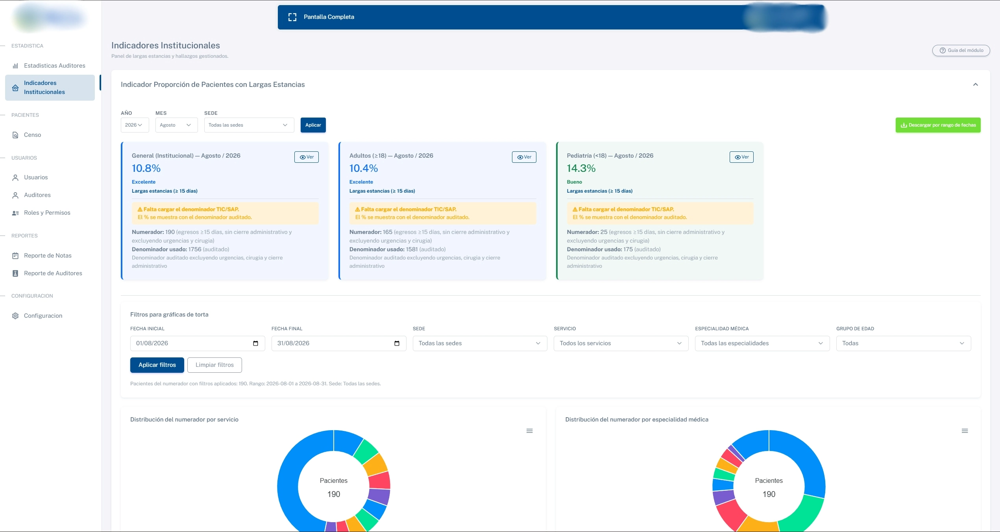
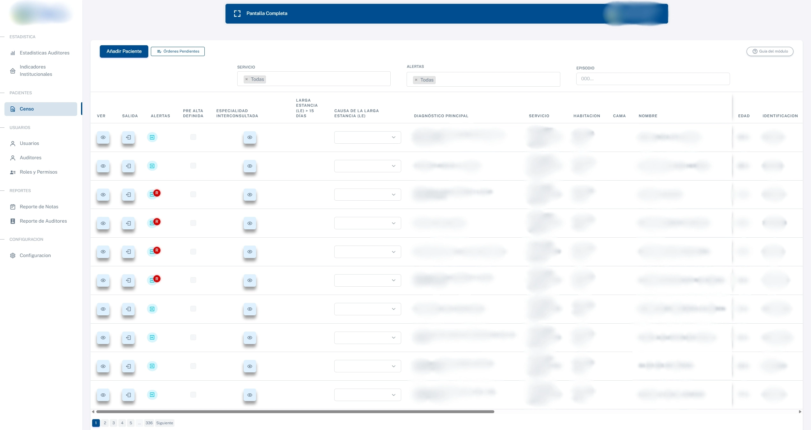
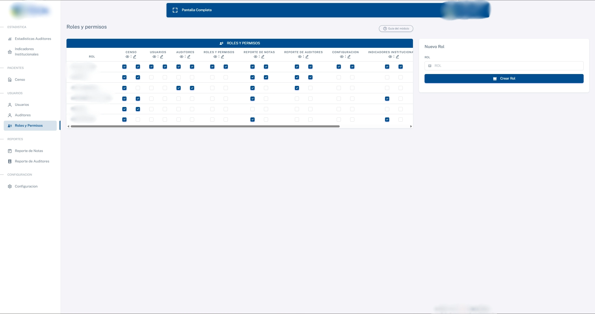
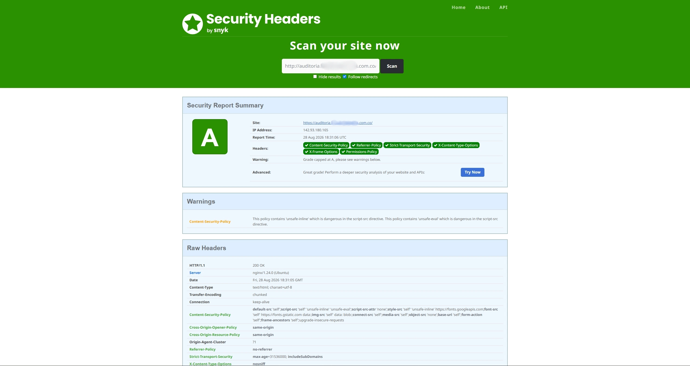
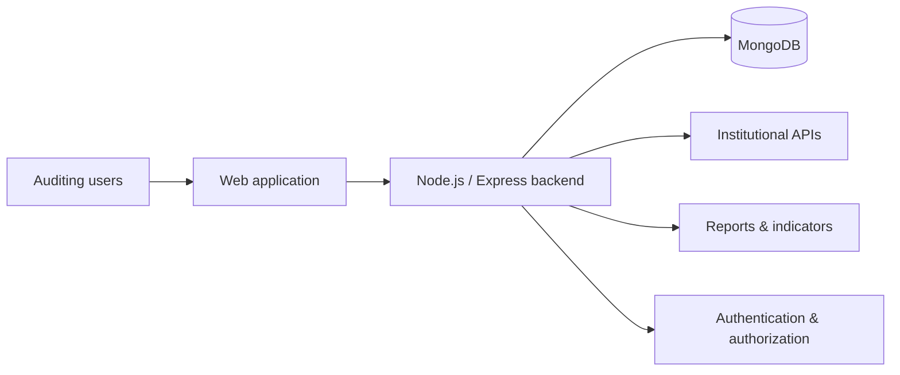

# Concurrent Hospital Auditing

| | |
| --- | --- |
| **Domain** | Healthtech |
| **Role** | Full Stack Developer |
| **Work type** | Enterprise product development and evolution |
| **Focus** | Backend · Integrations · Reporting · Security |
| **Repository** | Private |

## Context

This platform supports concurrent hospital-auditing workflows. It centralizes operational and clinical-review information used during hospitalization and provides tools for follow-up, traceability, reporting and institutional indicators.

I joined the project during an **early stage**, when a partial base of modules already existed. From that starting point, I progressively helped build and evolve the system as new operational requirements appeared.

## My contribution

My work has included:

- developing and extending backend modules and business flows;
- implementing REST endpoints, controllers, validations and data models;
- evolving concurrent-note and hospital-auditing workflows;
- working on hospital-discharge and follow-up functionality;
- implementing and extending reports and institutional indicators;
- integrating information received from institutional services/APIs;
- improving database queries and code organization;
- strengthening authentication, authorization and application security;
- improving traceability and consistency across critical workflows.

## Product evidence

### Institutional indicators

  

The reporting layer turns operational records into indicators that can be filtered by period, site, service, specialty and other auditing dimensions.

### Hospital census workflow

  

The census view centralizes patient episodes and auditing actions. Sensitive patient fields are intentionally redacted in this public evidence.

### Roles and permissions

  

Role-based access is configurable across major application modules, helping keep operational capabilities aligned with user responsibilities.

### HTTP security assessment

  

A sanitized external assessment is included as evidence of the application's HTTP hardening work. Hostnames, IP addresses and infrastructure details are removed before publication.

## Simplified architecture

This diagram is intentionally generic and does not represent private infrastructure.

## Engineering challenges

### Evolving an existing product

The system has grown through many iterations. New requirements need to coexist with previous auditing workflows instead of being implemented as isolated features.

### Complex business rules

Healthcare auditing contains conditional information and relationships between patient episodes, concurrent notes, follow-up records, discharge workflows and operational states. Keeping these rules explicit and maintainable is important.

### Traceability

Changes to auditing information can be operationally important. Consistency and visibility around who changed what are therefore key concerns.

### Integrations

Part of the application depends on information received from other institutional systems. This requires defensive validation and careful handling of incomplete or changing payloads.

## Security work

Security has been a recurring responsibility in this project, including:

- authentication and authorization controls;
- role-based access;
- request validation;
- HTTP security hardening;
- route and sensitive-operation protection;
- safer handling of application data;
- review of exposed attack surfaces.

## Technologies

`Node.js` · `Express.js` · `MongoDB` · `Mongoose` · `EJS` · `REST APIs` · `ExcelJS` · `JWT` · `Helmet`

## Outcome

The platform has been able to **expand progressively as the auditing process evolves**, incorporating new operational flows, reporting capabilities and institutional indicators while preserving existing behavior.

My work has contributed to making those changes easier to maintain, more traceable and better protected through explicit backend rules and security controls.

## What this project demonstrates

- Working on an enterprise product from an early stage.
- Growing a system incrementally rather than rebuilding it from scratch.
- Translating operational requirements into backend rules and modules.
- Working with data and integrations from external systems.
- Building reporting and traceability around real processes.
- Treating security as part of normal product development.

## Confidentiality

Client identity, patient information, internal endpoints, infrastructure details and proprietary code are intentionally excluded.

---

**Navigation:** [← Gran Frutiver](./gran-frutiver-san-francisco.md) · [Overview](../README.md) · [Next: Financial Applications Platform →](./financial-applications-platform.md)
