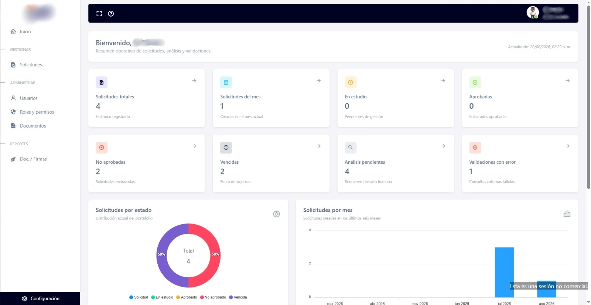
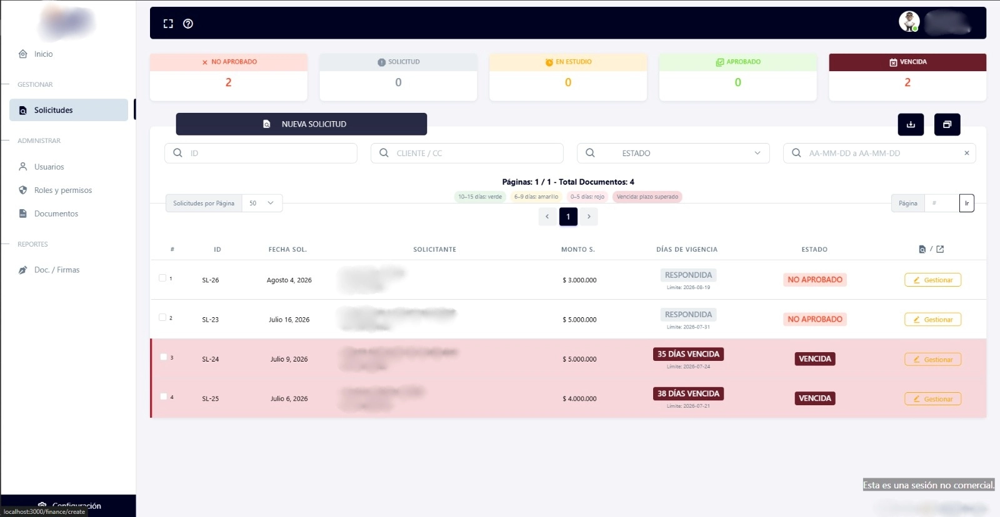
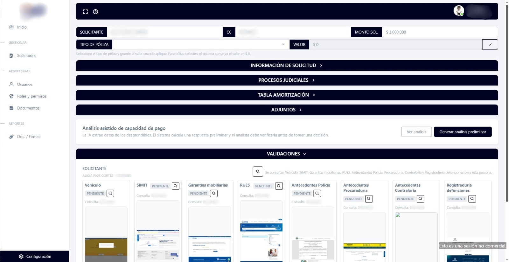
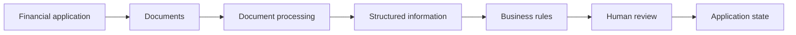
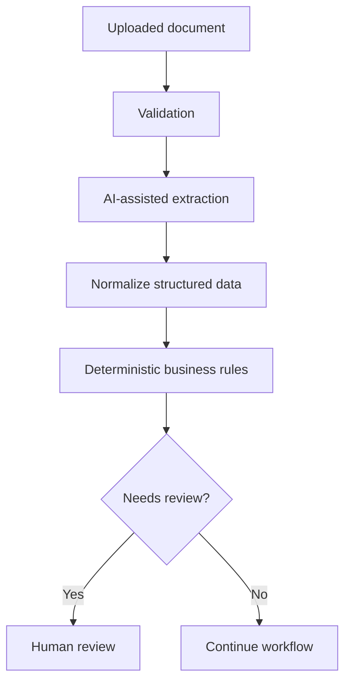

# Financial Applications Platform

| | |
| --- | --- |
| **Domain** | Fintech / financial operations |
| **Role** | Full Stack Developer |
| **Work type** | Product transformation and reengineering |
| **Focus** | Domain migration · Documents · Business rules · Security |
| **Repository** | Private |

## Context

The starting point for this project was an existing application originally designed for **legal-sector workflows**.

My work has focused on progressively transforming that codebase into a platform for **financial application management and analysis**, adapting the product to a substantially different business domain.

This is not simply a visual redesign: changing domains requires revisiting data models, workflows, terminology, validations, document handling and business rules.

## My contribution

My work has included:

- transforming modules inherited from the original legal application;
- adapting data structures and flows to financial processes;
- developing and modifying backend logic for financial applications;
- working with document-heavy workflows;
- integrating automated document processing;
- supporting rules used during financial analysis;
- integrating external services where required;
- improving authentication, authorization and application security;
- progressively removing assumptions tied to the original legal domain.

## Product evidence

### Operational dashboard

  

The dashboard summarizes application states and pending analysis, giving operational users a quick view of the current portfolio.

### Application lifecycle

  

Applications are tracked through explicit states and validity periods, making overdue or rejected items immediately visible.

### Assisted analysis and validations

  

The system combines document-derived information, backend calculations and external validations while preserving a human-review step before consequential decisions.

## Simplified flow

## Product transformation

The most relevant engineering challenge is that the platform was **not originally designed for its current purpose**.

Each change requires distinguishing between:

- reusable infrastructure;
- legal-domain assumptions that should disappear;
- models that can be adapted;
- flows that need redesign;
- terminology that no longer represents the product;
- security expectations for the new financial context.

## Document processing

The application includes automated processing of financial documents to extract structured information that can later be evaluated by backend rules.

Where AI-assisted extraction is used, it is one part of a wider process rather than an autonomous decision-maker.

## Security work

Because the platform handles financial workflows and documents, I have also worked on:

- authentication and authorization;
- validation of incoming data;
- protection of sensitive routes and operations;
- safer document-processing flows;
- HTTP/application hardening;
- reducing unnecessary exposure inherited from the previous system.

## Technologies

`Node.js` · `Express.js` · `MongoDB` · `Mongoose` · `EJS` · `REST APIs` · `Gemini` · `Puppeteer` · `Socket.IO` · `S3-compatible storage` · `ExcelJS`

## Outcome

The existing codebase has been able to **move progressively away from its original legal-domain assumptions and toward a financial application workflow** without requiring a complete rewrite.

The product now supports clearer application-state management, document-oriented analysis, automated validations and assisted analysis while keeping human review in the loop.

## What this project demonstrates

- Reengineering an existing product for a different industry.
- Working with legacy assumptions instead of starting from a blank repository.
- Designing document-oriented backend workflows.
- Combining automated extraction with deterministic business logic.
- Preserving human review for consequential decisions.
- Maintaining security while a product is being transformed.

## Confidentiality

The original product name, financial entity, applicant information, internal rules, documents, infrastructure details and proprietary code are intentionally excluded.

---

**Navigation:** [← Concurrent Hospital Auditing](./concurrent-hospital-auditing.md) · [Overview](../README.md) · [Next: Clinical Record Auditing →](./clinical-record-auditing.md)
