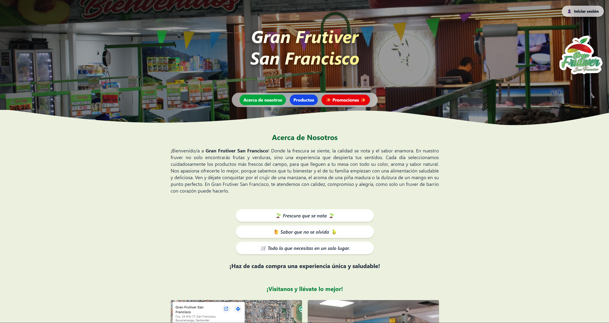
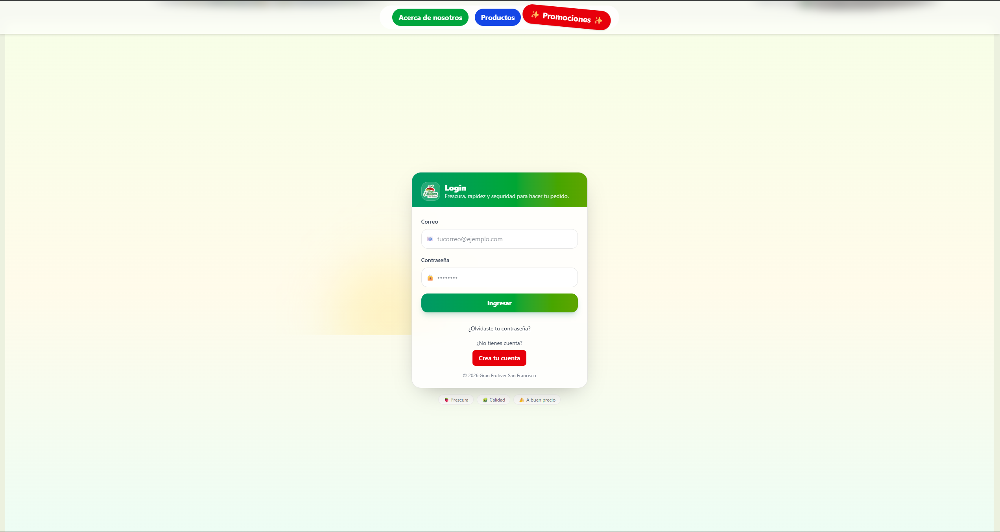
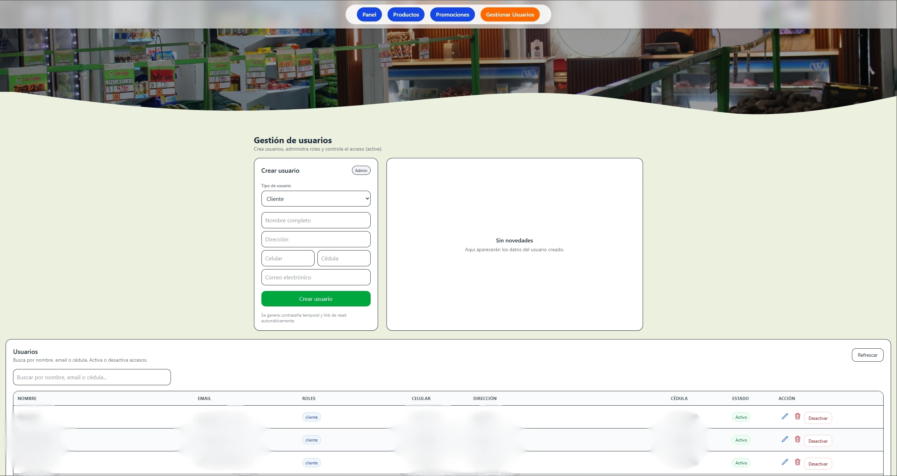
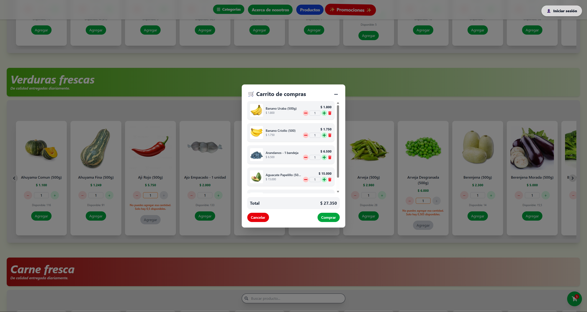
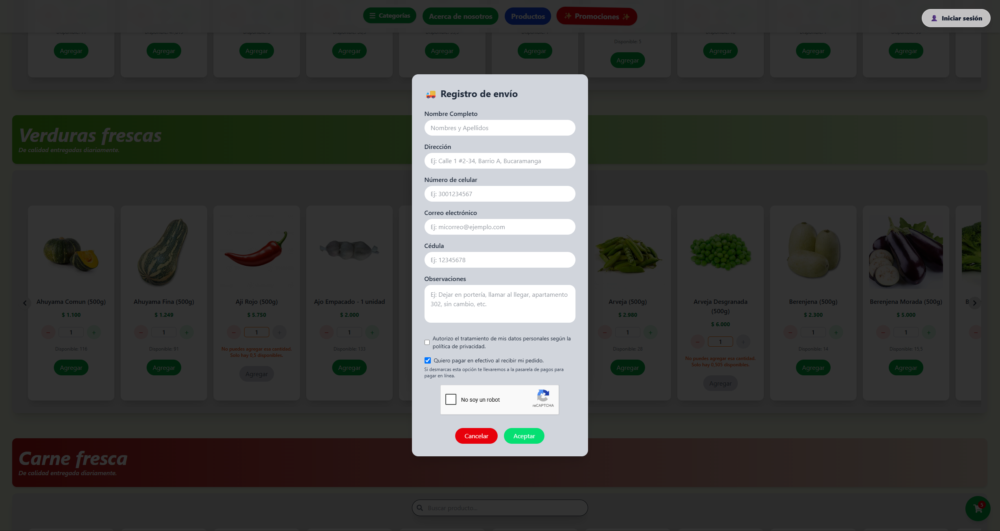
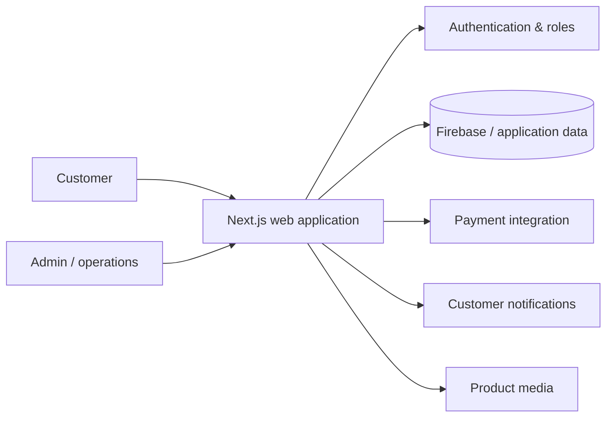

# Gran Frutiver San Francisco

| | |
| --- | --- |
| **Domain** | E-commerce / local retail |
| **Role** | Full Stack Developer |
| **Work type** | Independent end-to-end product development |
| **Focus** | Product · Frontend · Backend · Payments · Operations |
| **Repository** | Private at the client's request |

## Context

Gran Frutiver San Francisco needed a digital channel that could support both the customer purchasing experience and the operational side of a local retail business.

Unlike my enterprise work, where I joined existing products, this project gave me responsibility across the complete product lifecycle: **requirements gathering, solution design, implementation, deployment and ongoing maintenance**.

## My contribution

I independently worked on the product from the initial business needs through its current evolution, including:

- requirements gathering with the client;
- product and technical design;
- customer-facing catalog and shopping flows;
- authentication and role-based experiences;
- product, promotion and inventory administration;
- customer, administrator and packing/operational roles;
- shopping cart and checkout workflows;
- payment integration and order-state management;
- customer notifications;
- deployment and ongoing maintenance.

## Product evidence

### Customer-facing storefront

  

The public-facing experience introduces the business and provides access to its product and promotion flows.

### Authentication

  

Authentication supports the different roles used by the platform and routes users into the appropriate operational experience.

### User administration

  

Administrative functionality includes user creation, role assignment and access management.

### Shopping cart

  

The cart validates quantities against available inventory and gives customers a clear view of the current order before checkout.

### Checkout and delivery information

  

Checkout gathers delivery information, privacy consent and payment-related choices before the order continues through the operational flow.

## Simplified architecture

This diagram is intentionally simplified and does not expose private configuration.

## Engineering challenges

### Translating a physical retail workflow into software

The product needed to reflect how the business actually operates, rather than forcing the client into a generic e-commerce model. That required understanding product availability, order preparation, roles and customer communication.

### Inventory consistency

Order creation and inventory updates must remain consistent. The implementation uses transactional behavior around order/inventory operations to reduce the risk of accepting quantities that are no longer available.

### Multiple user roles

Customers, administrators and operational users have different goals. Keeping permissions and interfaces aligned with each role was important for both usability and security.

### External integrations

Payments, messaging and media storage introduce failure states outside the application itself. These integrations require validation, status handling and defensive behavior.

## Security considerations

Security-related work includes:

- role-based access control;
- authentication and authorization checks;
- input validation;
- reCAPTCHA in customer-facing flows;
- safer handling of payment/order state;
- keeping secrets and private configuration outside the public codebase.

## Technologies

`Next.js` · `React` · `Node.js` · `Firebase` · `Tailwind CSS` · `Twilio` · `Payment integration` · `Vercel`

## Outcome

The project took a real local-retail requirement from **initial discovery to a deployed product** that supports customer purchasing and internal operations.

It also gave me direct experience making product decisions beyond implementation: balancing client requirements, technical constraints, usability, integrations and maintenance over time.

## What this project demonstrates

- Full ownership of a product lifecycle.
- Translating non-technical business needs into software.
- Building customer and administrative experiences in the same product.
- Integrating payments and notifications.
- Maintaining and evolving software after deployment.

## Confidentiality

The repository is private at the client's request. Secrets, payment configuration and customer information are not published.

---

**Navigation:** [← Overview](../README.md) · [Next: Concurrent Hospital Auditing →](./concurrent-hospital-auditing.md)
